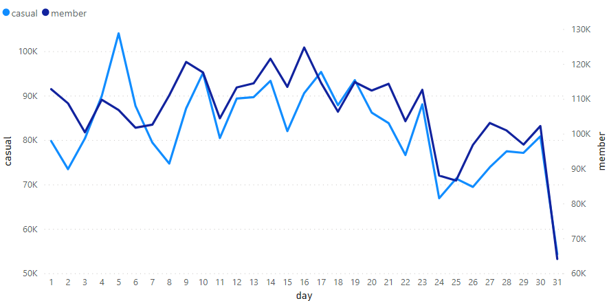

# Cyclistic Bike-Share

### Table of Content
<ul>
  <li><a href="#ask">A clear statement of the business task</a></li>
  <li><a href="#prepare">A description of all data sources used</a></li>
  <li><a href="#process">Documentation of any cleaning or manipulation of data</a></li>
  <li><a href="#analyze">A summary of your analysis</a></li>
  <li><a href="#share">Supporting visualizations and key findings</a></li>
  <li><a href="#act">Top recommendations based on your analysis</a></li>
</ul>

## Business Task

Cyclistic, a bike-share company in Chicago. The director of marketing believes the company’s future success depends on maximizing the number of annual memberships. Therefore, the team wants to understand **how casual riders and annual members use Cyclistic bikes differently.** From these insights, the team will design a new marketing strategy to convert casual riders into annual members. But first, Cyclistic executives must approve the recommendations, so they must be backed up with compelling data insights and professional data visualizations. 

#### Characters
- **Lily Moreno**: The director of marketing and your manager. Moreno is responsible for the development of campaigns and initiatives to promote the bike-share program. These may include email, social media, and other channels.
- **Cyclistic marketing analytics team**: A team of data analysts who are responsible for collecting, analyzing, and reporting data that helps guide Cyclistic marketing strategy.
- **Cyclistic executive team**: The notoriously detail-oriented executive team will decide whether to approve the recommended marketing program.

## Data Sources

We will use Cyclistic’s historical trip data to analyze and identify trends. [Download the previous 12 months of Cyclistic trip data here](https://divvy-tripdata.s3.amazonaws.com/index.html). The data has been made available by Motivate International Inc. under this [license](https://www.divvybikes.com/data-license-agreement). 

The data is organized in **Chronological order**. Where we took the data from June-2021 to May-2022. In each month we have the data of two types of membership i.e., **Casual Riders** and **Annual Members**.

In data, **fields** share the information of 
- **Personal Info**: ride_id, rideable_type, member_casual
- **Route Info**: geoloc, station, duration. Where station's id & name in station section, lattitude & longitude in geoloc section and started_at & ended_at in duration.

The data source is:
- Reliable
- Original
- Comprehensive
- Current
- Cited

## Cleaning or manipulation of data

Follow these steps:
1. Download the previous 12 months of Cyclistic trip data.
2. Unzip the files.
3. Create a folder on your desktop or Drive to house the files. Use appropriate file-naming conventions.

We will deal with basic cleaning and manipulation of data like:
- Duplicate data
- Outdated data
- Incomplete data
- Incorrect/inaccurate data
- Inconsistence data

Here is the [Documentation](https://github.com/greyisbetter/Cyclistic-Bike-Share/blob/main/data-process.md) for each step of **Data Process**.

## Summary of analysis

1. In the top 15 most traffic stations, we have a higher number of casual riders than annual members and the order deficit ratio seems to be inverted.

2. Despite the casual riders being only 43.68%, their average time and distance is higher than the annual members.
**Casual riders and Annual Members distribution**

**Average Time and Distance of Casual and Annual Members**

3. Casual riders use only a few stations in the city of Chicago, while annual members use stations across the city.
**Top 50 Casual Rider's Home Stations**

**Top 50 Annual Members's Home Stations**

4. A major difference that shows that 13.55% of casual riders use docked bikes in place of classic bikes, but this is not the case with the annual members.
**Bike Choice of Casual Riders**

**Bike Choice of Annual Members**

5. Casual riders mostly use bikes on weekends while annual members have more bike usage than casual riders in the long run.
**The average traffic of Casual and Annual members in a Week**

**The average traffic of Casual and Annual members in a Month**

**The average traffic of Casual and Annual members in a Year**

## Supporting visualizations and key findings

The visualizations should clearly communicate your high-level insights and recommendations. [Link of the Visualization Presentation](./Dashboard.pdf)

## Recommendations based on your analysis

1. As we can see, casual riders use Cyclistic-bikes at specific stations where we have a high number of bikes usage.
2. We can show the ease of use of docked bikes for annual members in that specific area.
3. How can being an annual member be more rewarding for using Cyclistic-Bikes on weekends.
4. How can being an annual member be of more helpful when using Cyclistic-bikes for longer routes.